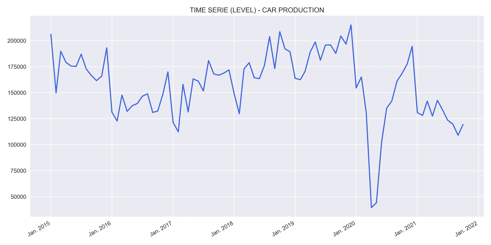
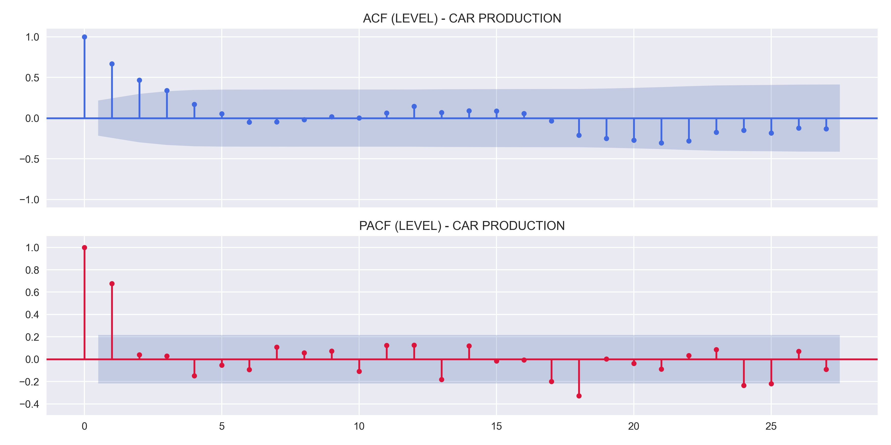
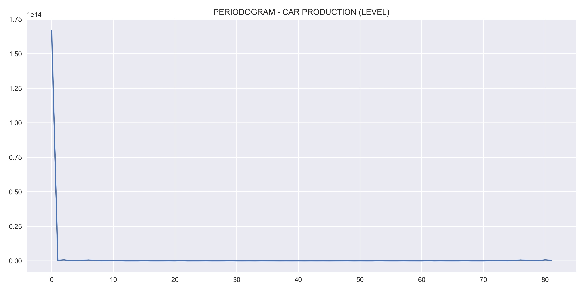
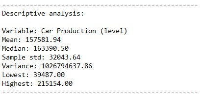
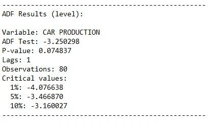
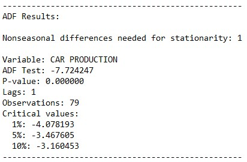
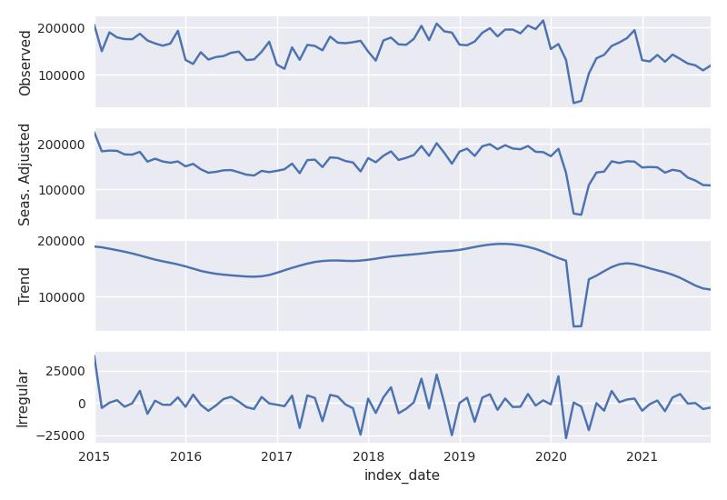
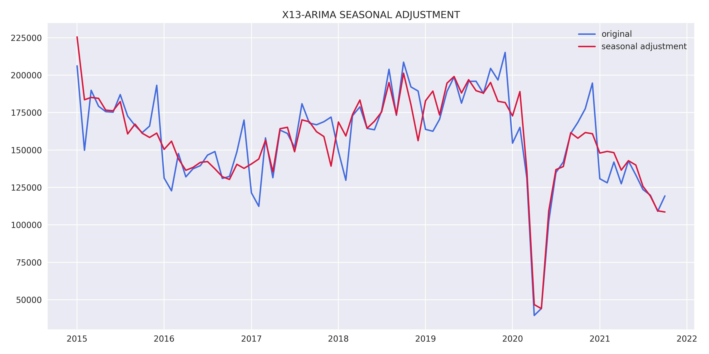
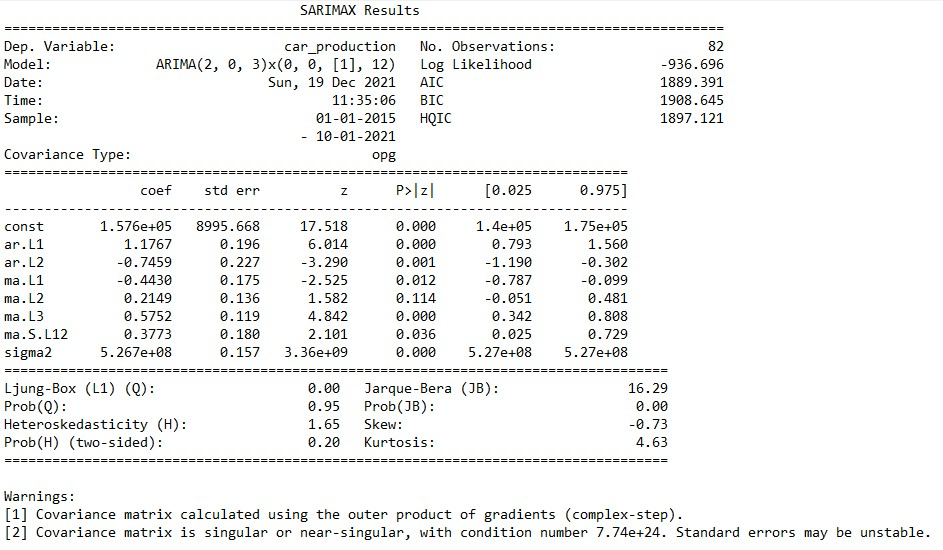

# **DESCRIPTION**
Values of the production of motor vehicles in the country. They reflect the sales performance of companies associated with:

• Stock and sale of vehicles by dealerships;

• Production and sales of vehicles and similar;

• Motorcycle production and sales.

Source: https://dadosabertos.bcb.gov.br/dataset/7384-vendas-de-veiculos-pelas-concessionarias---automoveis

# **RESULTS**
Results obtained through the model estimation process.

## Variable analysis at level:
    

    

    

    

## Study of data stationarity:
    

    

## X13-ARIMA-SEATS RESULTS:
    

    

## Model results:
    

## Residual analysis:
    

    

    

## Forecast:
    
